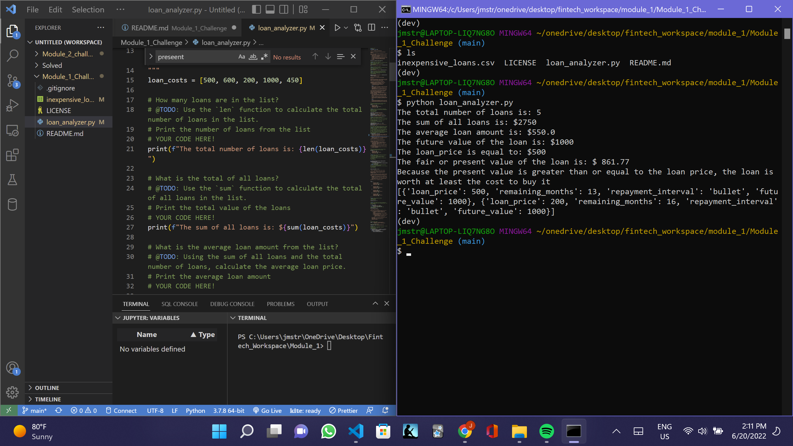

# First Challenge Project at Columbia Engineering Fintech Program: Valuing Microcredit Loans for a Lending Startup

In this project, firstly, I will automate simple calculations for the loan portfolio summaries, such as summing the loans, finding the total number of loans and calculate the average loan price. Secondly, I will analyze the loans, by extracting the future value through a present value function, using an annual discount rate of 20%. Thirdly, I will create a list of inexpensive loans and append the loans that are less than or equal to $500.00 to the inexpesive loan list, and print the list. Finally, I will save the inexpensive loan list in a csv file that I will create using a csvwriter.

---

## Technologies

I have a dev environment activated on my system with the Python 3.7.13 version.

---

## Installation Guide

Git clone the repo, and run it, including by python loan_analyzer.py.

Run the following:

```
python loan_analyzer.py

```

---

## Usage

## 

## Contributors

This is the first of the individual learning challenges.

My contact information is:

Linkedin: https://www.linkedin.com/in/jeffsmith77/ </br>
Personal email: jmstranslate@gmail.com </br>
Phone: 332 238 5209

---

## License

MIT License

Copyright (c) 2022 Jeffrey M. Smith
